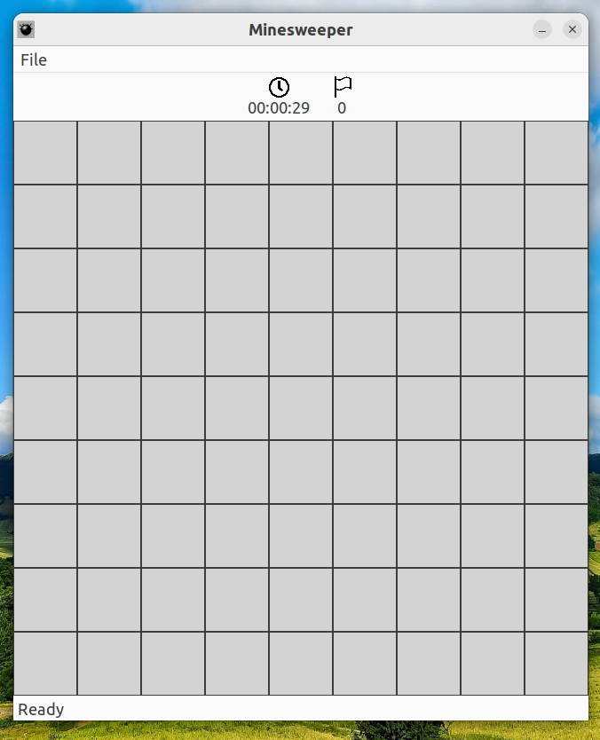
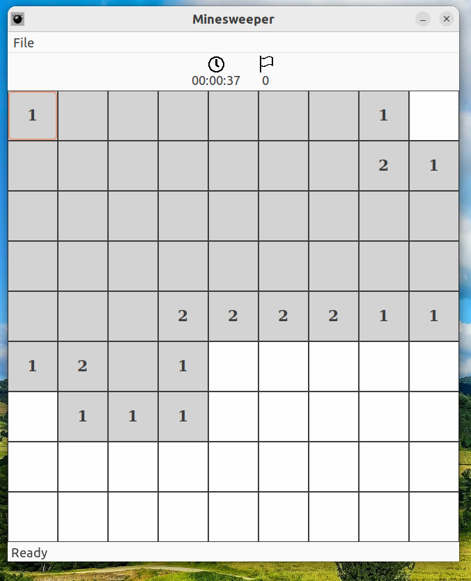
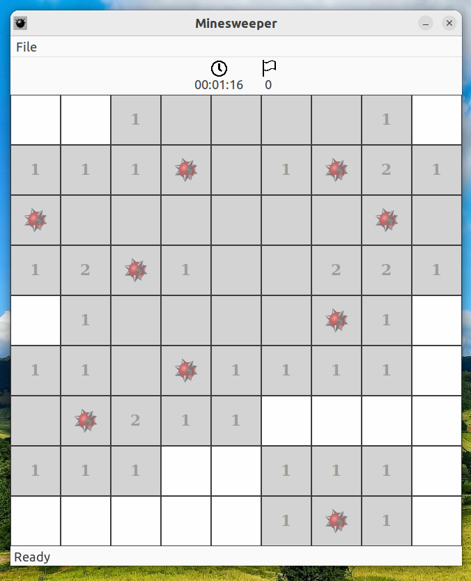

[](https://github.com/henrykorir/wxMinesweeper/actions/workflows/cmake-multi-platform.yml)
# wxMinesweeper
This is a proof-of-concept (poc) that is achieving the use of  C++ library wxWidgets to build a GUI

## Rule of the game
Flag all the mine fields
## Build
Ensute you have cmake.</br>If you don't have visit https://cmake.org/</br>
Clone the repo
```
git clone https://github.com/henrykorir/wxMinesweeper.git
cd ./wxMinesweeper
cmake .
cmake --build .
```

## To Be Done
[x] Left Mouse click to flag a mine field </br>
[x] End game when all fields are flaged </br>
[x] Restart game <br/>

## Demo



